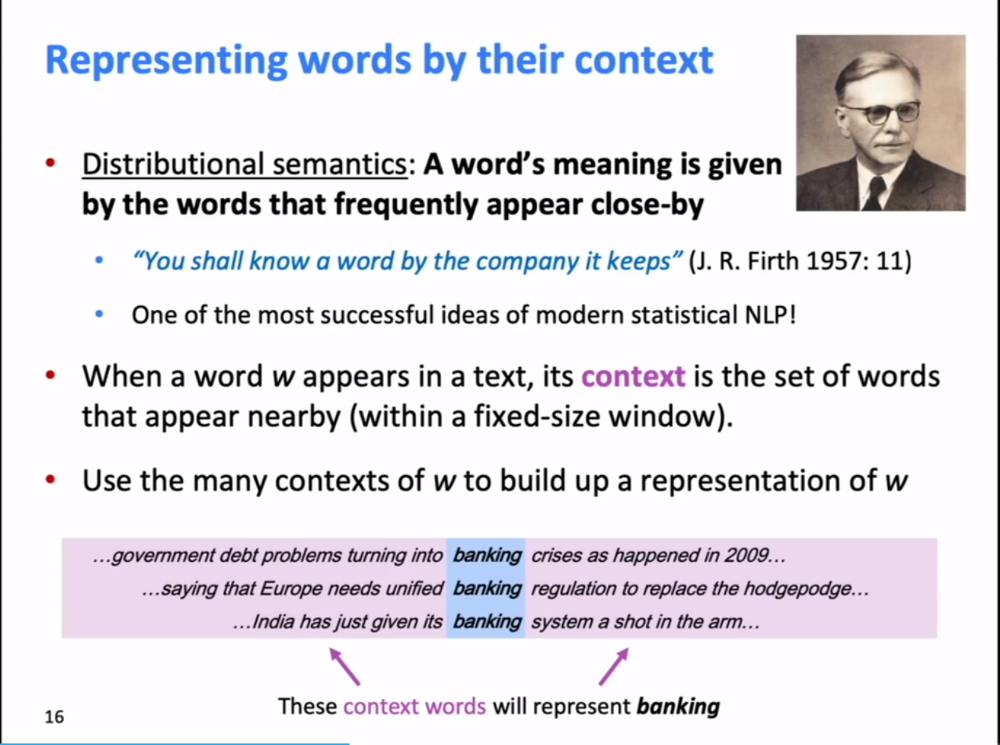
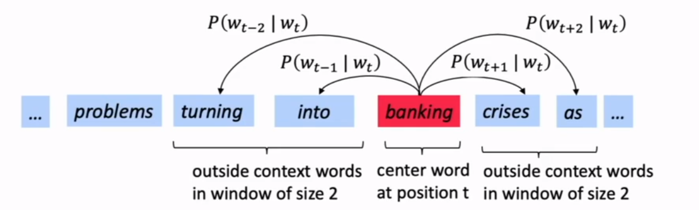
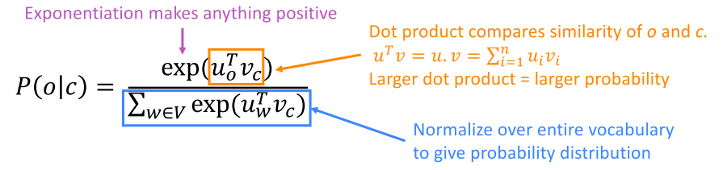
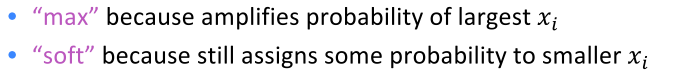

## CS224N-01-Introduction and Word Vectors

**[CS224N Home](https://web.stanford.edu/class/archive/cs/cs224n/cs224n.1194/)** 【Stanford NLP】
**[Video](https://www.bilibili.com/video/BV1r4411f7td)** 【Bilibili】

第一课的内容主要包含两个方面，一个是介绍如何表达词的含义，从传统的词表示方法引入分布式语义表达，引出word vector，第二个方面是讲解了word2vec的原理，从word2vec的损失函数和计算推导方面剖析了word vector的原理。尤其是最后的损失函数推导计算，从公式方面解释了优化词向量的内涵。

### 1、Human language and word meaning
第一部分从传统的词表示引入到word vector，传统的表示方式是独热编码，由分布式语义产出词向量。
* XKCD cartoon


#### Definition: **meaning** (Webster dictionary)
#### Common solution: **WordNet**
#### Problems with resources like WordNet:
* Great as a resource but missing nuance, 细微差别
* missing new meaning of words, 单词含义
* Subjective, 主观的
* Requires human labor to create and adapt, 需要人工
* Can't compute accurate word similarity, 无法计算相似度

#### Representing words as discrete symbols
traditional NLP，a localist representation
**Means one 1, the rest 0s**
独热编码（ont-hot）
```
motel=[0 0 0 0 1 0]
hotel=[0 1 0 0 0 0]
```
但是独热编码的结果是，这些词向量都是正交的，并且不能表达语义相似度。orthogonal（正交）、no natural notion of similarity
解决方案就是`learn to encode similarity in the vectors themselves`

#### Representing words by their context


**Distributional semantics**: A word's meaning is given by the words that frequently appear close-by
**Word vectors** (word embeddings): dense vector

#### Word meaning as as neural word vector - visualization


### 2、Word2vec: Overview
**Word2vec (Mikolov et al. 2013) is a framework for learning word vectors.**
**Idea:**
* a large corpus of text，首先有一个语料库
* 每个词给一个初始化的vector
* 遍历text中的每个位置，包含了center word [c]和context words [o]
* 根据c和o的词向量的相似度来计算，给出c得出o的似然
* 调整优化word vectors来最小化似然

图示：

计算$P(w_{t+j}|w_t)$
#### Word2vec: objective function
对于每一个text的位置$t=1,...,T$，给出中心词$w_j$，预测窗口为m内的上下文。
其似然值为：
$$Likelihood=L(\theta)=\prod_{t=1}^T\prod_{-m\le{j}\le{m} \atop{j\ne0}}P(w_{t+j}|w_t)$$ $\theta$ is all variables to be optimized.
损失函数$J(\theta)$是（平均）负的对数似然，**negative log likelihood**:
$$J(\theta)=-\frac{1}{T}logJ(\theta)=-\frac{1}{T}\sum_{t=1}^T\sum_{-m\le{j}\le{m} \atop{j\ne0}}P(w_{t+j}|w_t)$$**Minimizing objective function <==> Maxmizing predictive accuracy**

想要最小化损失函数，首先要考虑怎么计算$P(w_{t+j}|w_t)$
对于每个词给定两个词向量
* $v_w$，当w为中心词时
* $u_w$，当w为上下文时

对于每个中心词c和上下文词o，有：
$$P(o|c)=\frac{exp(u_o^Tv_c)}{\sum_{w\in{V}}exp(u_w^Tv_c)}$$分子上的向量点乘表达的是两个词的相似度，分母是中心词和所有词的相似度（**注意：这里是所有词，后续优化**）

**softmax** function：为什么成为softmax


#### To train the model: Compute all vector gradients
$\theta$ represents all model parameters, in one long vector
Remember: every word has two vectors

上述推导中，$P(x|c)$是给定中心词 $c$，模型所给出的为 $x$ 的概率。

这个推导结果很有趣！等号左边是给出中心词 $c$ 其上下文 $o$ 的对数概率的偏导，是我们要找的一个下降对快的一个方向，多维空间上的一个斜坡。等号右边的含义是，我们观察到的上下文的词 $o$ ，从中减去我们的模型认为的上下文的样子，后面一部分是模型的期望。实际的上下文与模型认为的上下文，这两者之间的差异决定了下降的方向。